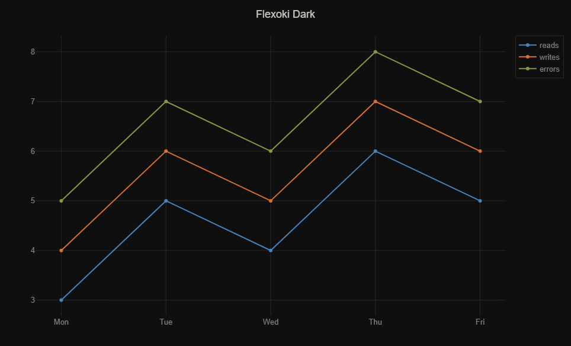
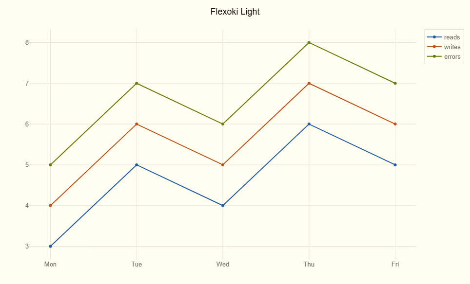

# flexoki-plotly

Light and dark [Plotly](https://plotly.com/python/) themes built from [Flexoki](https://stephango.com/flexoki), Steph Ango's inky color scheme for prose and code.

Registers two templates — `flexoki_light` and `flexoki_dark` — that you can pass to any Plotly figure.

## Interactive showcase

**[Open interactive showcase →](https://swishhhh.github.io/flexoki-plotly/)**

<table>
	<tr>
		<td><a></a></td>
		<td><a></a></td>
	</tr>
</table>

## Install

**Option A — pip install straight from this repo** (once it's pushed to GitHub):

```bash
pip install git+https://github.com/swishhhh/flexoki-plotly.git
```

**Option B — local editable install** (if you cloned it):

```bash
pip install -e .
```

**Option C — just copy the file.** `flexoki_plotly.py` has no dependencies beyond `plotly`, so you can drop it straight into another project's source tree and `import flexoki_plotly`.

## Usage

```python
import plotly.graph_objects as go
import flexoki_plotly  # registers "flexoki_light" and "flexoki_dark" on import

fig = go.Figure(go.Scatter(x=[1, 2, 3], y=[3, 1, 2]))
fig.update_layout(template="flexoki_light")   # or "flexoki_dark"
fig.show()
```

Works with Plotly Express too:

```python
import plotly.express as px
import flexoki_plotly

fig = px.bar(df, x="category", y="value", template="flexoki_dark")
```

### Set as the default for a whole script/notebook

```python
import plotly.io as pio
import flexoki_plotly

pio.templates.default = "flexoki_light"
```

### Layer on top of Plotly's built-in defaults

Template strings can be combined with `+`, so you can keep Plotly's default spacing/margins and just swap in Flexoki colors:

```python
pio.templates.default = "plotly+flexoki_dark"
```

## What's themed

- Plot/paper background, gridlines, axis lines and ticks
- Title, axis titles, tick labels, legend
- Hover label background/border
- Trace colorway (8 accent colors, in this order): blue, orange, green, magenta, cyan, red, yellow, purple
- Sequential and diverging colorscales

Light mode uses Flexoki's `-600` accent weights; dark mode uses `-400`, matching Flexoki's own light/dark mapping (see [stephango.com/flexoki](https://stephango.com/flexoki#accent-colors)).

## Try it

For a broader chart showcase, run:

```bash
python scripts/showcase.py --output docs/showcase
python scripts/showcase.py --theme flexoki_dark --output docs/showcase
```

Each run writes one HTML file per chart into `docs/showcase/`. The [interactive chart showcase](docs/index.html) presents every chart sequentially in both themes.

The repository workflow regenerates the showcase whenever the theme or showcase script changes and checks that the generated HTML is committed.


## Palette reference

| Role | Light | Dark |
| --- | --- | --- |
| Background | `#FFFCF0` | `#100F0F` |
| Background 2 | `#F2F0E5` | `#1C1B1A` |
| Border (ui) | `#E6E4D9` | `#282726` |
| Border hover (ui-2) | `#DAD8CE` | `#343331` |
| Border active (ui-3) | `#CECDC3` | `#403E3C` |
| Faint text (tx-3) | `#B7B5AC` | `#575653` |
| Muted text (tx-2) | `#6F6E69` | `#878580` |
| Text | `#100F0F` | `#CECDC3` |

| Accent | Light (600) | Dark (400) |
| --- | --- | --- |
| Blue | `#205EA6` | `#4385BE` |
| Orange | `#BC5215` | `#DA702C` |
| Green | `#66800B` | `#879A39` |
| Magenta | `#A02F6F` | `#CE5D97` |
| Cyan | `#24837B` | `#3AA99F` |
| Red | `#AF3029` | `#D14D41` |
| Yellow | `#AD8301` | `#D0A215` |
| Purple | `#5E409D` | `#8B7EC8` |

Full palette, including the extended 50–950 scale for each color, is documented at [stephango.com/flexoki](https://stephango.com/flexoki).

## Updating the theme

All colors live at the top of `flexoki_plotly.py` in the `LIGHT`, `DARK`, `ACCENTS_LIGHT`, and `ACCENTS_DARK` dicts/lists — edit those and re-run `scripts/showcase.py` to check the result. Layout structure (what maps to what — e.g. `axis.gridcolor`) lives in `_build_template()`.

## Reference

Built against [Plotly's theming/templates docs](https://plotly.com/python/templates/#creating-themes). See that page for the full template API (`go.layout.Template`, combining themes with `+`, `pio.templates`, etc.) if you want to extend this further.

## License

MIT. Flexoki's color values are themselves MIT-licensed (© Steph Ango, [flexoki repo](https://github.com/kepano/flexoki)) — see `LICENSE` for attribution.
